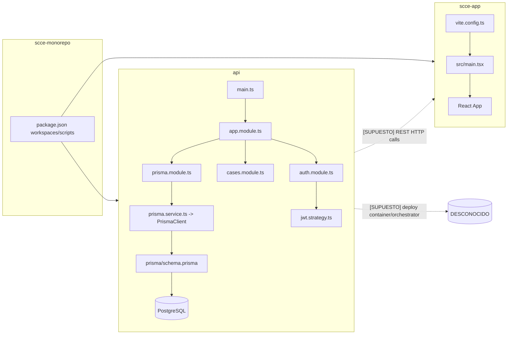

# FASE 1 — MAPEO (Estructural)

## Contexto operativo
- Endpoints aproximados: DESCONOCIDO
- Usuarios concurrentes: DESCONOCIDO
- Base de datos: PostgreSQL (Prisma datasource `provider = "postgresql"`).
- Entorno de despliegue: DESCONOCIDO
- Datos sensibles presentes (sí/no): Sí (credenciales, hash de contraseña, JWT).

## A) Tabla Stack Detectado

| Capa | Detectado | Evidencia |
|---|---|---|
| Runtime backend | Node.js + NestJS | `api/package.json` (`@nestjs/*`, scripts `nest start`) |
| Runtime frontend | React 19 + Vite 7 | `scce-app/package.json` (`react`, `vite`) |
| Framework backend | NestJS | `api/src/main.ts`, `api/src/app.module.ts` |
| Framework frontend | React + Vite | `scce-app/vite.config.ts`, `scce-app/src/main.tsx` |
| Bundler | Vite (frontend) | `scce-app/package.json` script `build`, `vite.config.ts` |
| Test runner | Jest (backend unit/e2e) | `api/package.json` scripts `test*`, `api/jest-e2e.json` |
| ORM | Prisma | `api/package.json` (`prisma*` scripts), `api/prisma/schema.prisma` |
| DB | PostgreSQL | `api/prisma/schema.prisma` datasource |
| Auth | JWT + Passport-JWT | `api/src/auth/auth.module.ts`, `api/src/auth/jwt.strategy.ts` |
| Logging | Solo logger por defecto Nest (no configuración explícita) | `api/src/main.ts` (sin logger custom) |
| Deploy | DESCONOCIDO | No se observan manifiestos de despliegue en inputs analizados |

## B) Mapa de Carpetas (2–3 capas)

1. **Monorepo raíz (orquestación):**
   - `package.json` con workspaces `scce-app`, `api`, `packages/*`.
   - Scripts de arranque concurrente y utilidades DB/e2e.

2. **`api/` (backend NestJS + Prisma):**
   - `src/`: módulos HTTP y dominio aplicativo (`auth`, `cases`, controladores).
   - `prisma/`: esquema, migraciones, seed y utilitarios SQL.
   - `test/`: e2e Jest con setup dedicado.

3. **`scce-app/` (frontend React/Vite):**
   - `src/`: UI/componentes/config/domain.
   - `docs/` y `audit/`: documentación funcional/técnica.
   - Configuración TypeScript/Vite/ESLint local.

## C) Diagrama Mermaid Forense

## D) Preguntas de Bloqueo (máx 5)

1. ¿Cuál es el entorno objetivo de despliegue (VM, contenedor, Kubernetes, PaaS)? **PENDIENTE POR EVIDENCIA**.
2. ¿Existe API gateway / reverse proxy que imponga TLS, rate limiting o CORS adicional? **PENDIENTE POR EVIDENCIA**.
3. ¿Qué volumen real de concurrencia y SLA se espera para API y frontend? **PENDIENTE POR EVIDENCIA**.
4. ¿`packages/*` contiene librerías TypeScript activas o está vacío/no usado? **PENDIENTE POR EVIDENCIA**.
5. ¿Se exige rotación/gestión externa de secretos (`JWT_SECRET`, `DATABASE_URL`) en producción? **PENDIENTE POR EVIDENCIA**.
